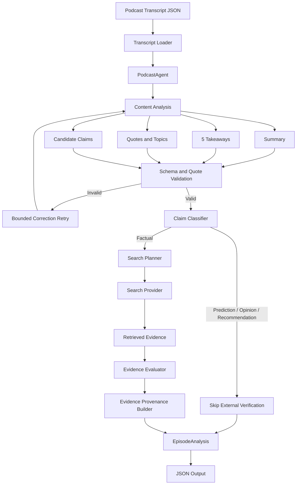

# Application Architecture

## Overview

The Podcast Content Agent is a single-orchestrator agentic application that transforms podcast transcripts into structured editorial content and performs evidence-backed fact checking.

The architecture deliberately separates two types of behavior:

- **Probabilistic reasoning**, performed by the language model.
- **Deterministic controls**, enforced by application code.

The language model is responsible for tasks that require semantic interpretation, such as identifying claims, classifying statements, planning searches, and evaluating evidence. Application code controls workflow execution, validates model output, invokes external tools, preserves evidence provenance, and determines whether invalid output may continue through the pipeline.

This allows the system to use agentic reasoning without treating model output as inherently trustworthy.

## Application Flow



## Stage 1: Transcript Loading

Input transcripts are parsed into typed Pydantic models containing episode metadata and timestamped transcript segments.

The structured transcript becomes the source of truth for downstream processing.

## Stage 2: Content Analysis

The model receives the transcript and generates:

- a 200–300 word summary
- exactly five takeaways
- notable quotes with speakers and timestamps
- topic labels
- candidate factual claims

This stage intentionally performs the primary editorial analysis in one model interaction rather than distributing the work across multiple independent agents.

The result is simpler orchestration, fewer model calls, and a smaller failure surface.

## Stage 3: Deterministic Validation

Model output is not accepted directly.

The application validates the generated response using Pydantic and additional deterministic checks.

Validation includes:

- output schema correctness
- summary length
- exactly five takeaways
- quote timestamp validity
- quote speaker validity
- quote text grounding against the original transcript

Quote validation is particularly important because quotations are intended for publication. A fluent but fabricated quotation is therefore treated as invalid output rather than acceptable model variation.

If validation fails, the application supplies corrective context and retries generation.

Retries are bounded. Persistent invalid output causes processing to fail rather than allowing malformed or ungrounded content to silently continue.

## Stage 4: Claim Classification

Candidate claims are individually classified as:

- factual
- prediction
- opinion
- recommendation
- unverifiable

Classification determines whether external retrieval should occur.

Only factual claims are routed to the retrieval workflow.

A deterministic model invariant also verifies the routing decision. For example, a prediction cannot simultaneously be marked as requiring factual verification.

This prevents statements such as forecasts or subjective recommendations from being presented as externally verified facts.

## Stage 5: Search Planning

For factual claims, the model generates a search plan containing one or more focused queries.

Search planning is separate from retrieval.

The model determines **what should be searched**, while application code determines **how the search tool is invoked**.

This separation allows compound or ambiguous claims to be decomposed into more useful searches without giving the model direct control over the retrieval implementation.

## Stage 6: Evidence Retrieval

The search provider executes the planned queries.

The current implementation uses Brave Web Search.

Retrieved results contain:

- title
- URL
- snippet

Duplicate URLs are removed before evidence evaluation.

Search results are treated only as evidence candidates. Retrieval itself does not establish that a claim is true.

## Stage 7: Evidence Evaluation

The model receives the original claim and the retrieved evidence and determines whether the evidence supports the claim.

The result contains:

- verification status
- confidence
- selected evidence references
- explanation

Supported verification states are:

- `verified`
- `possibly_outdated_or_inaccurate`
- `unverifiable`

Confidence represents the model's confidence in its assessment and is not intended to represent a statistically calibrated probability.

If no evidence is retrieved, the application returns an unverifiable assessment rather than asking the model to infer supporting evidence.

## Stage 8: Evidence Provenance

The language model does not generate final evidence URLs.

Retrieved search results are numbered before evidence evaluation. The model may select evidence by index, but application code maps those indices back to the original retrieved results.

This preserves the actual:

- source title
- URL
- domain
- evidence snippet

Invalid evidence indices are rejected.

This boundary reduces the risk of fabricated citations entering the final output.

## Final Output

The completed `EpisodeAnalysis` contains:

```text
episode metadata
        |
        +-- summary
        |
        +-- takeaways
        |
        +-- quotes
        |
        +-- topics
        |
        +-- candidate claims
        |
        +-- fact checks
                |
                +-- claim
                +-- timestamp
                +-- status
                +-- confidence
                +-- evidence
                +-- explanation
```

The validated result is serialized as JSON.

## Why This Is Agentic

The application is agentic because the model participates in decisions that affect subsequent execution rather than only producing a single final response.

For factual verification, the control loop is:

```text
Observe transcript
       |
       v
Identify candidate claim
       |
       v
Classify statement
       |
       v
Decide whether retrieval is appropriate
       |
       v
Plan searches
       |
       v
Application invokes tool
       |
       v
Observe evidence
       |
       v
Evaluate evidence
       |
       v
Produce structured assessment
```

The execution path therefore changes based on intermediate model decisions and observations.

At the same time, the model does not control the entire application. Tool execution, validation, retry limits, evidence provenance, and final serialization remain deterministic application responsibilities.

## Why a Single Orchestrator

A multi-agent architecture was considered unnecessary for this workload.

The tasks form a relatively short and predictable dependency graph, and there is little benefit in introducing independently operating agents for summarization, retrieval, and verification.

A single orchestrator provides:

- explicit control flow
- fewer model calls
- lower latency and cost
- simpler debugging
- clearer logs
- easier deterministic testing
- fewer coordination failure modes

If future requirements introduced independent long-running tasks, specialized models, parallel research, human approval workflows, or significantly more complex tool use, the orchestration model could be revisited.

## Provider Boundaries

External capabilities are abstracted behind provider interfaces.

```text
PodcastAgent
     |
     +---- ModelProvider
     |        |
     |        +---- AnthropicProvider
     |
     +---- ClaimVerifier
              |
              +---- SearchProvider
                       |
                       +---- BraveSearchProvider
```

This prevents the core orchestration logic from being tightly coupled to the prototype providers.

For example, a production customer deployment could replace the current model provider with Amazon Bedrock without redesigning the agent workflow.

## Observability

The application emits structured operational traces for major workflow decisions and actions, including:

- content-analysis attempts
- validation failures
- candidate claim counts
- claim classifications
- retrieval decisions
- planned searches
- search execution
- evidence counts
- verification results
- final output counts

These logs expose the agent's execution path and decisions without depending on private model chain-of-thought.

## Failure Model

The prototype is designed to fail explicitly rather than silently manufacture valid-looking output.

Examples include:

```text
Invalid model structure
        -> bounded correction retry
        -> fail if still invalid

Ungrounded quotation
        -> validation failure
        -> bounded correction retry

Prediction or opinion
        -> retrieval skipped

No external evidence
        -> unverifiable

Invalid evidence reference
        -> reject result

Persistent provider/application failure
        -> processing fails visibly
```

Production retry, queueing, dead-letter handling, service-level fault tolerance, and provider fallback strategies are covered separately in the deployment strategy.

## Scope Boundary

This document describes the architecture of the implemented application.

The local implementation is intentionally synchronous and processes transcript files through a CLI/container workflow.

The production infrastructure required to operate this system at scale—including asynchronous job processing, Kubernetes, cloud networking, autoscaling, IAM, secrets management, observability, CI/CD, and fault tolerance—is described separately in [`deployment-strategy.md`](deployment-strategy.md).
