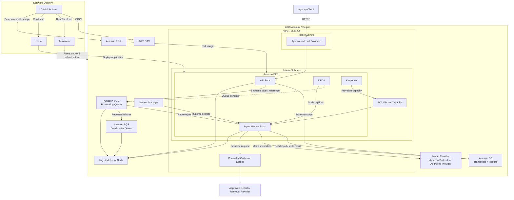

# Production Architecture and Deployment Strategy

## Overview

The implementation is a locally runnable, containerized agentic application. This document describes how that application could be deployed and operated as a production service for an advertising agency.

The reference architecture uses AWS and Amazon EKS. It is designed around several workload characteristics:

- Podcast processing is asynchronous and does not require a long-lived client request.
- Processing time varies with transcript size, factual claim count, model latency, retrieval latency, and retries.
- Accepted jobs should not be silently lost if a worker or node fails.
- Application workers are stateless and can scale horizontally.
- Model inference is externally hosted in the reference architecture, so agent workers do not require GPUs.
- Customer transcripts may contain sensitive information and require explicit security and retention controls.
- The application may eventually need to run in customer-managed, hybrid, or on-premises environments.

The architecture therefore separates request ingestion, durable storage, job queuing, agent execution, external AI services, and platform operations.

---

## Reference Architecture



The diagram represents infrastructure and deployment boundaries rather than the internal agent workflow. The internal content-analysis and fact-checking workflow is documented separately in [`architecture.md`](architecture.md).

---

## Processing Model

Podcast processing is modeled as an asynchronous job.

A client submits a transcript to the API. The API stores the transcript in Amazon S3 and publishes a small job message to Amazon SQS containing identifiers and an object reference rather than embedding the full transcript in the queue.

For example:

```json
{
  "job_id": "abc123",
  "episode_id": "ep001",
  "input_uri": "s3://podcast-content-prod/input/abc123/transcript.json"
}
```

A worker receives the message, retrieves the transcript, executes the agent workflow, validates the result, writes the output to S3, and only then acknowledges the SQS message.

The processing sequence is:

1. Accept transcript.
2. Persist transcript to durable object storage.
3. Enqueue the processing job.
4. Worker receives the job.
5. Worker retrieves the transcript.
6. Agent performs content analysis.
7. Agent classifies candidate factual claims.
8. Agent retrieves and evaluates supporting evidence.
9. Application validates the generated result.
10. Worker persists the final result.
11. Worker deletes the queue message.

This separates client request latency from agent processing latency and allows processing capacity to scale independently from ingestion capacity.

---

## Queueing and Failure Recovery

Amazon SQS decouples job submission from worker availability.

The queue absorbs bursts of work when the number of submitted episodes exceeds available processing capacity. Workers consume jobs as capacity becomes available rather than requiring clients to maintain long-running HTTP requests.

A message is not deleted when it is first received. SQS visibility timeout temporarily hides the message while the worker processes it. The visibility timeout should be sized against expected processing duration and extended while a healthy worker continues long-running processing. This reduces premature redelivery while preserving recovery when a worker actually fails.

Successful processing follows:

```text
Receive message
      ↓
Process episode
      ↓
Validate result
      ↓
Persist result
      ↓
Delete message
```

If a worker or node fails before the message is deleted, the visibility timeout eventually expires and the job becomes available to another worker.

Repeated failures are routed to a dead-letter queue after the configured receive threshold.

The DLQ provides a visible recovery path for failures such as:

- malformed transcripts
- persistent schema violations
- repeated provider failures
- unsupported input
- application defects

DLQ depth should generate an operational alert and failed jobs can be investigated and selectively redriven after remediation.

Because queue delivery should be treated as at-least-once processing, workers must tolerate duplicate job delivery. Deterministic input and output keys based on `job_id` provide a basic idempotency boundary. A stronger job-state or idempotency store could be introduced if duplicate external model calls become operationally or financially significant.

---

## Kubernetes Workloads

The EKS deployment separates lightweight request handling from expensive agent processing.

### API Workload

The API is responsible for:

- accepting requests
- validating request metadata
- persisting transcripts
- submitting processing jobs
- returning job identifiers or result locations

It does not execute the complete agent workflow inside the client request.

### Agent Worker Workload

Worker pods are responsible for:

- consuming SQS jobs
- loading transcripts
- running the agent workflow
- invoking model providers
- invoking retrieval providers
- validating results
- persisting completed output
- acknowledging completed queue messages

Workers remain stateless so they can be horizontally scaled or replaced without relying on local persistent storage.

---

## Workload and Node Scaling

Agent processing is primarily an asynchronous workload involving external model and retrieval calls. CPU utilization alone may therefore be a poor indication of processing demand.

For example, workers may have low CPU utilization while hundreds of episodes wait in SQS because workers are spending time waiting on model or search responses.

The reference architecture therefore separates workload scaling from infrastructure scaling.

### Worker Scaling

KEDA observes queue demand and adjusts the number of worker replicas.

Useful signals include:

- queue depth
- queue depth per active worker
- age of the oldest queued message

Queue age is particularly useful because it reflects how long customer work has been waiting rather than only how many jobs exist.

### Node Scaling

If Kubernetes requests more worker replicas than the current cluster can schedule, Karpenter provisions additional EC2 capacity.

The two scaling layers therefore answer different questions:

```text
KEDA:
How many application workers are required?

Karpenter:
How much infrastructure capacity is required to run those workers?
```

A small stable node pool can host critical cluster components while elastic worker capacity scales with processing demand.

Retryable asynchronous workers may be candidates for Spot capacity where interruption behavior and customer processing objectives allow it.

---

## GPU Strategy

The reference deployment does not require GPU worker nodes.

The agent performs orchestration, validation, retrieval, and API communication while model inference occurs through Amazon Bedrock or another approved external model provider.

CPU-based worker capacity is therefore sufficient.

If a customer requires self-hosted inference, model serving should be treated as a separate workload. A future design could introduce dedicated GPU node pools and an internal inference endpoint without requiring the agent workers themselves to run on GPU nodes.

---

## Networking

The reference architecture uses a multi-AZ VPC.

Internet-facing ingress terminates at an Application Load Balancer in public subnets. EKS worker nodes and application workloads remain in private subnets.

The worker workload does not require unsolicited inbound Internet connectivity.

Outbound connectivity depends on the selected providers.

AWS service traffic can use appropriate private AWS connectivity where security, availability, traffic volume, and cost justify it. External search or model providers require controlled outbound connectivity unless replaced by customer-managed services.

This distinction is important because a deployment using an external retrieval API cannot simultaneously claim to operate without Internet egress.

For environments where public access is not permitted, the API can instead use private ingress integrated with the customer's network.

---

## Identity and Access Management

Static AWS access keys are not stored in the application, container image, Kubernetes configuration, or GitHub repository.

AWS permissions are assigned using workload identity and least-privilege IAM roles.

The API and worker use separate identities because they have different responsibilities.

### API Role

Typical permissions include:

- write transcript objects to the designated S3 location
- submit messages to the processing queue

### Worker Role

Typical permissions include:

- receive processing messages
- delete successfully completed messages
- read transcript objects
- write result objects
- invoke the approved model provider when using an AWS-hosted model service

The worker should not receive unrelated administrative permissions.

CI/CD authentication is also independent from workload identity. GitHub Actions uses OIDC federation with AWS STS rather than long-lived AWS access keys.

Development and production deployment roles should be separated, with stronger approval and trust controls around production.

---

## Secrets Management

Provider credentials that cannot use workload identity, such as an external search API key, are stored in AWS Secrets Manager or the customer's approved secrets platform.

Secrets are supplied to workloads at runtime rather than committed to:

- Git
- container images
- Helm values
- ConfigMaps

The exact Kubernetes secret-injection mechanism can follow the customer's platform standard, such as a CSI-based integration or secrets controller.

AWS credentials themselves do not need to be stored as application secrets when workload identity is used.

---

## Data Protection and Retention

All external service communication uses TLS.

Customer data should also be encrypted at rest using the encryption capabilities of S3, SQS, Secrets Manager, ECR, and supporting AWS services. KMS key ownership and rotation policies should follow customer security requirements.

Raw transcripts and generated editorial content may require different retention periods.

S3 lifecycle policies should therefore implement customer-defined retention rather than retaining all content indefinitely.

A logical object layout could be:

```text
podcast-content-prod/
├── input/
│   └── {job_id}/transcript.json
└── output/
    └── {job_id}/result.json
```

Access logging, model prompts, search evidence, and application logs should also be reviewed for sensitive content. Production logging should avoid indiscriminately copying complete transcripts, secrets, or model responses into the observability platform.

---

## Kubernetes Security

Application workloads should use Kubernetes security controls appropriate to the customer environment, including:

- dedicated service accounts
- least-privilege RBAC
- non-root containers
- prevention of privilege escalation
- read-only filesystems where practical
- resource requests and limits
- readiness and liveness probes
- NetworkPolicies
- controlled namespace boundaries

Network policy should reflect actual application communication paths rather than permit unrestricted pod-to-pod access.

Container images should be scanned before promotion and deployed using immutable image identifiers rather than mutable `latest` tags.

---

## Reliability and Fault Tolerance

Reliability is considered at several independent layers.

### Application Failure

Model-generated content is treated as untrusted data.

Schema validation, quote grounding, routing invariants, evidence provenance checks, and bounded correction retries prevent malformed or unsupported model output from silently becoming final content.

### Provider Failure

Transient model or retrieval failures should use bounded retries with exponential backoff and jitter.

Examples include:

- throttling
- temporary network failure
- provider 5xx responses
- request timeout

Permanent authentication, authorization, or invalid-input failures should fail quickly rather than consume repeated retries.

Fact-checking degradation should never cause the system to invent evidence. Depending on customer requirements, retrieval failure can either fail the job or produce explicitly degraded/unverifiable verification output.

### Worker Failure

If a worker fails before acknowledging the SQS message, the job becomes available for another worker after the visibility timeout.

### Node Failure

Kubernetes replaces workloads from failed nodes and reschedules them onto available capacity. Karpenter can provision additional capacity when necessary.

### Availability Zone Failure

The EKS workload spans multiple Availability Zones. Remaining capacity can continue processing queued work when one AZ becomes unavailable.

S3 and SQS provide regional managed service boundaries rather than binding jobs to an individual worker node or Availability Zone.

### Repeated Job Failure

Repeated processing failures are moved to the DLQ for alerting, investigation, and controlled redrive.

### Deployment Failure

Application releases use immutable images and Helm release history.

A failed deployment can be stopped or rolled back to the previously validated application version.

Health checks should be supplemented by agent behavior evaluations because a container returning HTTP 200 does not demonstrate that the AI workflow still produces acceptable output.

---

## Observability

Operational health is measured at the job level rather than only at the container level.

### Infrastructure Metrics

Examples include:

- node availability
- pending pods
- pod restarts
- CPU and memory utilization
- Karpenter provisioning failures

### Application Metrics

Examples include:

- jobs accepted
- jobs started
- jobs completed
- jobs failed
- processing duration
- validation failures
- retry count
- number of fact checks performed

### Queue Metrics

Important queue indicators include:

- visible message count
- age of the oldest message
- DLQ message count

Queue age is especially important because it directly represents how long accepted customer work has been waiting.

### Provider Metrics

Examples include:

- model request latency
- model errors
- model throttling
- retrieval latency
- retrieval errors
- token or inference usage

### Structured Logging

Application logs should contain structured operational events such as:

```json
{
  "level": "INFO",
  "job_id": "abc123",
  "episode_id": "ep001",
  "stage": "evidence_evaluation",
  "claim_id": "claim-2",
  "status": "verified",
  "duration_ms": 842
}
```

These records expose actions, stages, results, timing, and failures without attempting to expose private model chain-of-thought.

Correlation identifiers allow operators to trace a job from ingestion through agent processing and provider interactions.

### Alerting

Initial production alerts should focus on conditions that affect the customer workflow:

- DLQ contains messages
- oldest queued message exceeds the agreed processing objective
- job failure rate exceeds threshold
- provider error or throttling rate increases
- queued work exists but successful completions stop
- worker capacity cannot scale

Infrastructure alarms remain useful, but service-level symptoms should drive operational response.

---

## Infrastructure as Code

Terraform owns AWS and platform infrastructure.

Representative resources include:

- VPC and subnet configuration
- routing and controlled egress
- EKS
- IAM roles and policies
- ECR
- S3
- SQS and DLQ
- Secrets Manager resources
- KMS configuration
- supporting AWS observability resources

Terraform changes follow their own validation, security scanning, plan, review, and apply lifecycle.

The infrastructure lifecycle remains separate from application releases so a Python or prompt change does not inherently require modifying cloud infrastructure.

---

## Kubernetes Packaging

Helm owns application resources inside Kubernetes.

Representative resources include:

- API Deployment
- worker Deployment
- Services
- ServiceAccounts
- ConfigMaps
- resource requests and limits
- health probes
- NetworkPolicies
- application autoscaling configuration

Platform-level components such as Karpenter and KEDA are installed and governed by the platform layer rather than bundled into the podcast application's Helm chart.

This maintains a clear boundary between platform ownership and application ownership.

---

## CI/CD and Promotion

The proposed software delivery workflow is:

```text
Pull Request
    │
    ├── unit tests
    ├── deterministic agent tests
    ├── golden transcript evaluations
    ├── SAST
    ├── dependency/SCA scanning
    ├── Terraform validation/plan
    └── Helm validation
          │
          ▼
        Merge
          │
          ▼
     Build Image
          │
          ▼
     Image Scan
          │
          ▼
     Amazon ECR
          │
          ▼
         Dev
          │
       evaluation
          ▼
       Staging
          │
       evaluation
          ▼
    Production Approval
          │
          ▼
         Prod
```

The container image is built once and promoted through environments using an immutable Git SHA or image digest.

The production image is not rebuilt after testing in lower environments.

GitHub Actions authenticates to AWS using OIDC and assumes environment-specific deployment roles through AWS STS.

---

## AI Evaluation as a Deployment Control

Traditional health checks alone are insufficient for an AI application.

A deployment can be technically healthy while producing degraded editorial or verification output.

The delivery pipeline should therefore combine normal software validation with representative agent evaluations.

Software controls include:

- unit tests
- schema tests
- configuration validation
- security scans
- container validation

AI behavior controls include:

- representative transcripts
- summary requirement checks
- exact quote grounding
- claim classification behavior
- evidence handling
- unverifiable-claim behavior

The deterministic tests implemented in the prototype provide the beginning of this deployment-quality boundary.

---

## Cost Considerations

The architecture separates fixed platform costs from workload-dependent costs.

### Major Variable Costs

Likely variable cost drivers include:

- model inference and token usage
- search or retrieval API usage
- worker compute
- network egress and NAT processing
- log and metric ingestion
- object storage

### Platform Costs

Platform costs include:

- EKS control plane
- Application Load Balancer
- stable cluster capacity
- NAT gateways
- selected VPC endpoints

At low workload volume, platform overhead may represent a significant percentage of total cost.

Cost controls include:

- selecting the smallest model that satisfies quality requirements
- avoiding unnecessary model invocations
- classifying claims before retrieval so predictions and opinions do not trigger unnecessary searches
- bounding retries
- scaling workers with queue demand
- scaling elastic worker capacity down when idle
- considering Spot capacity for retryable workers
- applying S3 lifecycle policies
- controlling log volume
- tracking model/token usage

VPC endpoints should be selected based on security requirements, traffic volume, availability requirements, and cost rather than assuming they are always cheaper than NAT-based access.

---

## Non-Functional Requirements

Specific production targets should be established with the customer rather than assumed by the implementation.

The following provide starting dimensions for discovery:

| Area | Proposed Objective | Architecture Response |
|---|---|---|
| Availability | Continue service through individual node or AZ failures | Multi-AZ EKS capacity and managed regional services |
| Durability | Accepted transcripts and jobs should not be silently lost | S3, SQS, visibility timeout, DLQ |
| Processing latency | Establish percentile completion target by transcript size | Queue-age monitoring and worker autoscaling |
| Scalability | Absorb bursty episode submissions | SQS buffering, KEDA, Karpenter |
| Security | Avoid static cloud credentials | Workload identity and GitHub OIDC |
| Data protection | Protect customer content in transit and at rest | TLS, encryption, KMS controls |
| Recovery | Preserve and recover failed work | Retry, visibility timeout, DLQ, controlled redrive |
| Deployability | Reproduce infrastructure and application releases | Terraform, Helm, immutable images |
| Observability | Trace a job across the processing lifecycle | Structured logs, metrics, correlation identifiers |
| Portability | Support customer-managed environments when required | Containers, Helm, provider boundaries |

These are architectural objectives rather than measured SLAs. Availability percentages, processing latency targets, RTO, and RPO should be agreed with the customer and validated through testing.

---

## Disaster Recovery

The reference deployment is multi-AZ within a single AWS Region.

Multi-AZ availability addresses node and Availability Zone failures but does not provide protection from a complete regional outage.

Regional disaster recovery should be driven by customer-defined:

- Recovery Time Objective (RTO)
- Recovery Point Objective (RPO)

If required, a regional recovery strategy could include:

- S3 cross-region replication
- ECR replication
- reproducible infrastructure through Terraform
- source-controlled Helm configuration
- replicated secrets/configuration strategy
- cross-region job-state recovery

An active-active multi-region architecture is not assumed because its additional complexity and cost may not be justified for an asynchronous podcast-processing workload.

---

## Deployment Portability and Customer-Managed Environments

AWS/EKS is the reference deployment, not an application dependency.

The containerized application and Kubernetes packaging provide a path toward deployment into customer-managed infrastructure.

A customer-managed implementation could map platform capabilities as follows:

| Capability | AWS Reference | Customer-Managed Alternative |
|---|---|---|
| Kubernetes | Amazon EKS | Kubernetes, OpenShift, or lightweight Kubernetes |
| Object storage | Amazon S3 | S3-compatible or customer object storage |
| Work queue | Amazon SQS | Kafka, RabbitMQ, NATS, or customer standard |
| Model inference | Amazon Bedrock / approved provider | local inference or approved model endpoint |
| Retrieval | approved search provider | enterprise knowledge base or internal search |
| Secrets | AWS Secrets Manager | Vault or customer secrets platform |
| Observability | AWS-integrated logging/metrics | Prometheus, Grafana, Loki, or customer stack |

For disconnected or edge environments, external model and search APIs may not be available. Those deployments would require local model inference and local retrieval sources.

Edge deployments may also require:

- smaller or quantized models
- constrained CPU/GPU and memory profiles
- local persistent queues
- local object storage
- tolerance for intermittent connectivity
- delayed synchronization with central systems

The current prototype implements model and search provider abstractions. Generic storage, queue, and secrets adapters are production design extensions and are not implemented by the take-home application.

This distinction prevents the reference AWS architecture from being presented as portability that the prototype does not yet implement.

---

## EKS Tradeoff

Amazon EKS is appropriate when the customer already operates Kubernetes, expects additional AI workloads, requires consistent Helm-based deployment, or values portability across cloud and customer-managed Kubernetes environments.

For a single low-volume AWS-only workload, ECS or Fargate could provide a simpler operational model with less platform overhead.

The production platform should therefore be selected during customer discovery rather than assuming Kubernetes is always required.

For this reference architecture, EKS is used under the assumption that the advertising agency wants a reusable platform for additional agentic workloads and values Kubernetes-based deployment consistency.

---

## Production Scope Boundary

The take-home implementation includes:

- the Python agent application
- model and search provider boundaries
- deterministic validation
- fact-checking and evidence provenance
- structured operational console output
- automated tests
- local Docker execution

The AWS/EKS architecture in this document is a proposed production deployment strategy.

The take-home does not claim to provision or operate the production AWS infrastructure described here.

This separation is intentional: the implemented application demonstrates the agent workflow, while this document demonstrates how that workload could be deployed and operated under production requirements.
